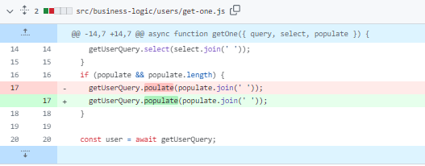

# Team API

## Team members

- Rodrigo Brevis
- Jorge Cortez

With this API you can manage users, clubs and members for your team (like sport team, university club, etc)

## Code corrections

In src/business-logic/users/get-one.js we fixed the populate method, previously it was called as poulate (line 17).

## Features 🚀

- Login ✅
- Create club ✅
- Add and list members to the specific club ✅
- Create a custom subscription for your club ✅
- Send automatic reminder notification to yours members (renew subscription) ⛔️
- Extract data (last payment, users with debt) ⛔️

## Initialization 💻

`npm i`

`npm run dev`

## Testing and coverage

`npm run coverage`

## Environment 🌿

- `MONGO_URI` = Mongo DB full URI (default: mongodb://localhost:27017/teams-api)
- `PORT` = port where the server is running (default: 3000)
- `CREATE_ADMIN` = boolean to enable the creation of admin user (optional)
- `CREATE_ADMIN_EMAIL` = The admin email (if the CREATE_ADMIN: true) (optional)
- `CREATE_ADMIN_PASSWORD` = The admin password (if the CREATE_ADMIN: true) (optional)
- `CREATE_ADMIN_NAME` = The admin name (if the CREATE_ADMIN: true) (optional)

## API Docs 📜

`Not yet 😞`

